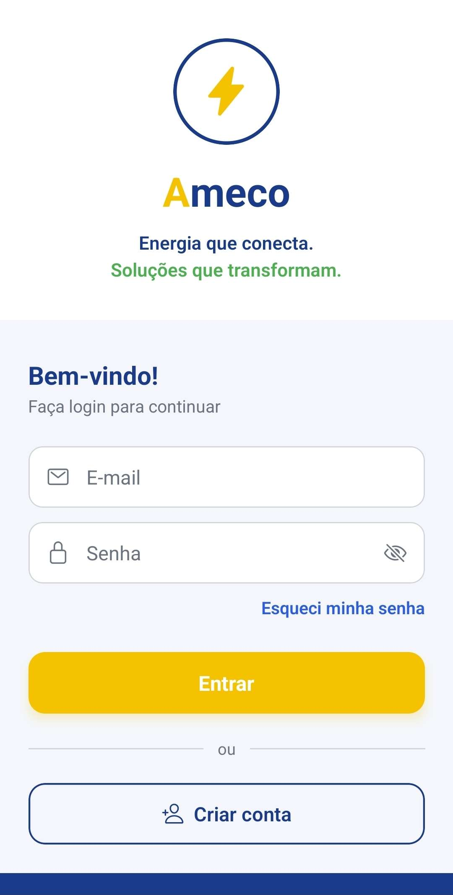
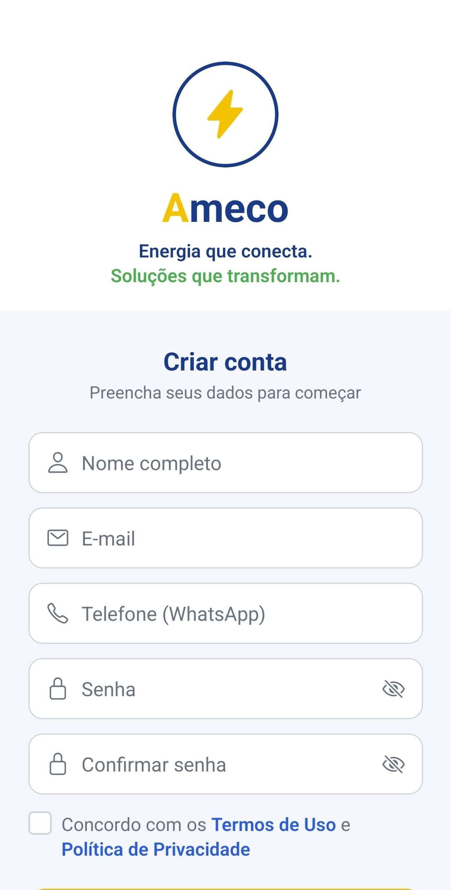
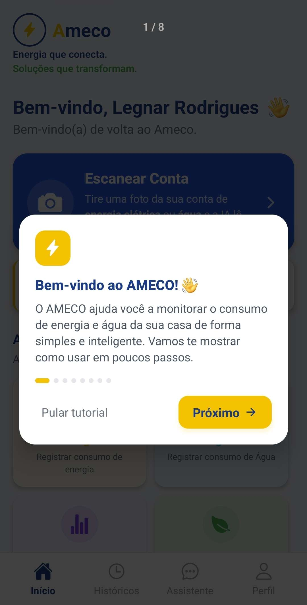
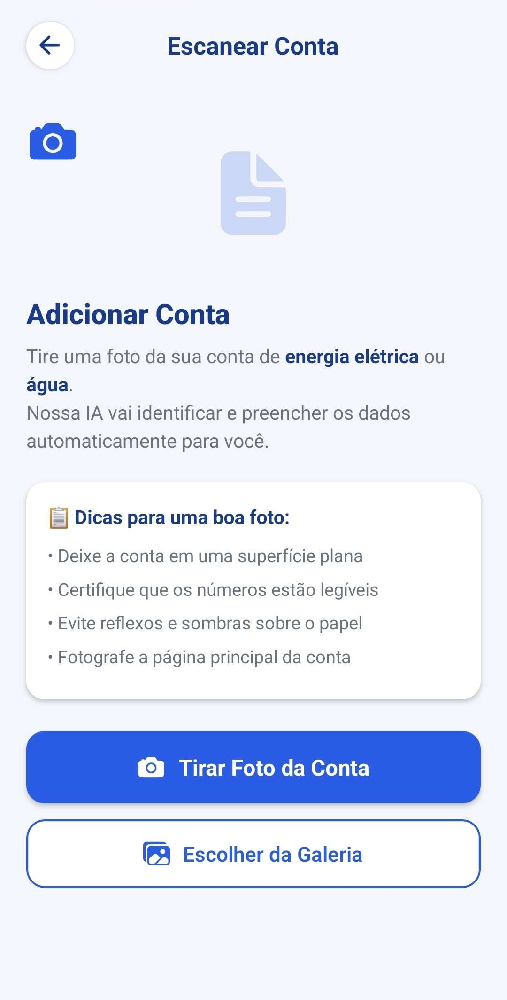
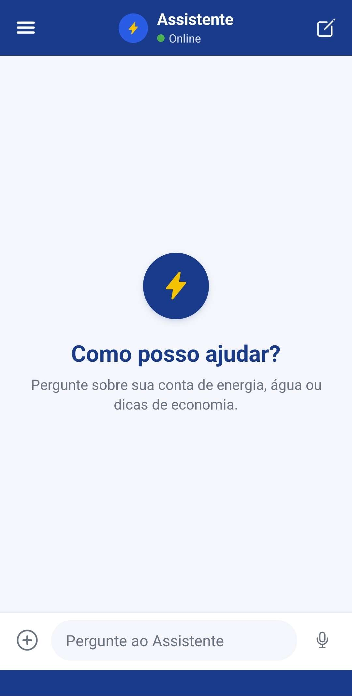
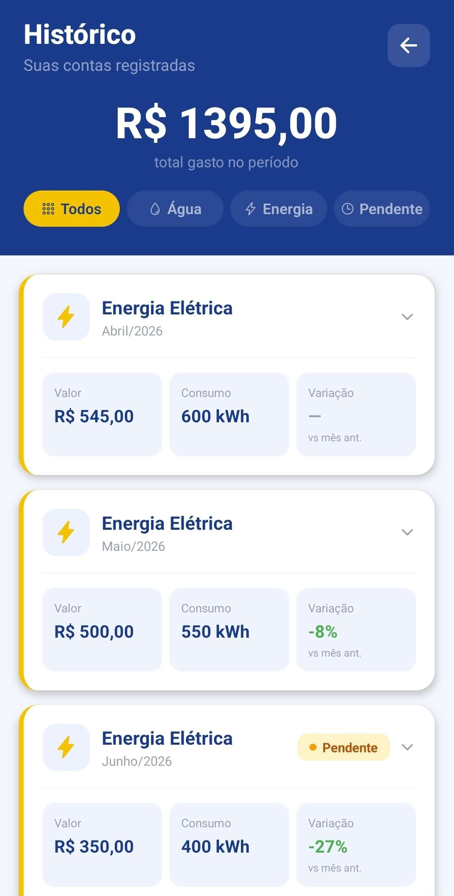
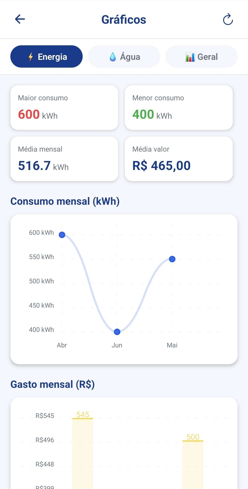
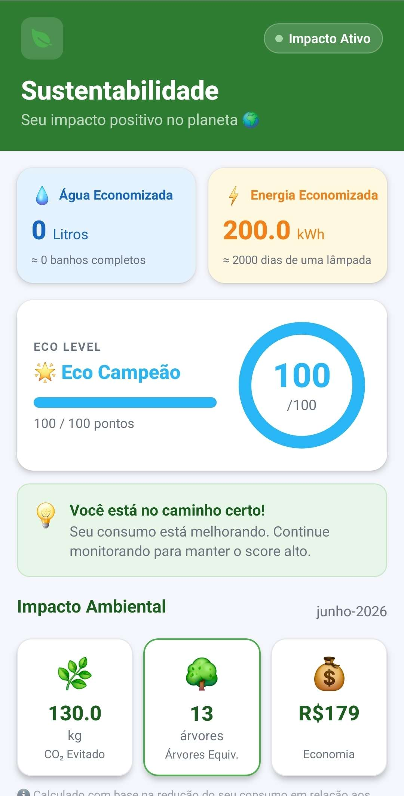

# AMECO Overview

Repositório de visão geral do projeto AMECO.

O AMECO é um aplicativo mobile voltado para sustentabilidade, economia financeira e monitoramento inteligente do consumo de energia elétrica e água. Seu principal diferencial é o scanner com IA, que permite ao usuário tirar uma foto ou enviar a imagem da conta de água ou energia para leitura automática dos dados. Este repositório centraliza a apresentação do projeto, sua arquitetura, sua organização e os passos iniciais para desenvolvimento.

## Objetivo

Este repositório existe para:

- apresentar o projeto de forma clara
- servir como ponto de entrada para novos colaboradores
- documentar a arquitetura geral
- organizar roadmap e próximos níveis da IA
- reunir links para os repositórios técnicos

## Função Principal do AMECO

O fluxo principal do AMECO é a leitura inteligente de contas de consumo.

Como funciona:

1. o usuário tira uma foto ou envia a imagem da conta de água ou energia
2. a IA analisa a conta e identifica os dados principais
3. o aplicativo apresenta os dados extraídos para revisão
4. os dados são salvos no histórico do usuário
5. o AMECO usa essas informações para realizar os cálculos e estimativas do aplicativo

Dados que podem ser extraídos:

- tipo da conta
- empresa fornecedora
- mês de referência
- vencimento
- consumo
- unidade de consumo
- valor total
- leituras anteriores e atuais

Com isso, o app reduz preenchimento manual e transforma a conta enviada pelo usuário em base para monitoramento, histórico e estimativas de gasto.

## Estrutura do Ecossistema

Atualmente o projeto está dividido em dois repositórios principais:

- App Mobile: `Ameco-front-end-App-Mobile-`
- Backend: `Ameco-Back-End-Servidor`

## Stack Principal

### Frontend

- React Native
- Expo SDK 54
- TypeScript

### Backend

- Node.js
- Express.js
- JavaScript com migração recomendada para TypeScript

### Banco e Serviços

- Firebase Authentication
- Firebase Firestore
- Firebase Storage

## Funcionalidades Atuais

### Scanner com IA

- captura de conta por câmera
- envio de imagem da galeria
- leitura automática de contas de energia e água
- revisão dos dados extraídos antes do salvamento
- verificação de contas duplicadas
- armazenamento dos dados para uso nos cálculos do app

### Energia

- cálculo de consumo em kWh
- estimativa mensal
- estimativa de valor da conta

### Água

- cálculo de consumo mensal
- estimativa de gastos
- histórico de utilização

### Perfil e Conta

- cadastro
- login
- armazenamento de dados

### IA Educativa

Nível atual: `Nível 1 - IA Conversacional`

Funções atuais:

- analisar contas a partir de imagem enviada pelo usuário
- explicar consumo
- responder dúvidas
- sugerir economia
- interpretar dados informados pelo usuário

## Documentação

- [Arquitetura](./docs/architecture.md)
- [Setup](./docs/setup.md)
- [Roadmap](./docs/roadmap.md)
- [Artigo Científico](./docs/publicacoes/artigo-cientifico-ameco.pdf)
- [Organização de Screenshots](./docs/screenshots.md)
- [Organização de Mídia](./docs/media.md)

## Demonstração

- Vídeo demonstrativo: https://youtu.be/Sl22f0KKgVE?si=ZdAx8Ulk9bq0XJ-G

## Principais Telas

### Autenticação

### Dashboard

### Scanner com IA

### Assistente IA

### Perfil

### Energia

### Sustentabilidade

## Downloads

- Releases do projeto: `https://github.com/LsRodri42/Ameco-Overview/releases`
- Versão atual planejada: `v1.0.0`
- Arquivo do app na release: `ameco-v1.0.apk`

## Direção Técnica

Prioridades atuais:

1. consolidar a base do app mobile
2. padronizar backend e contratos de API
3. manter IA com foco educativo e baixo custo operacional
4. evoluir documentação e organização do projeto

## Missão

Ajudar pessoas a economizar água e energia por meio de tecnologia acessível, promovendo sustentabilidade, consciência ambiental e economia financeira.
